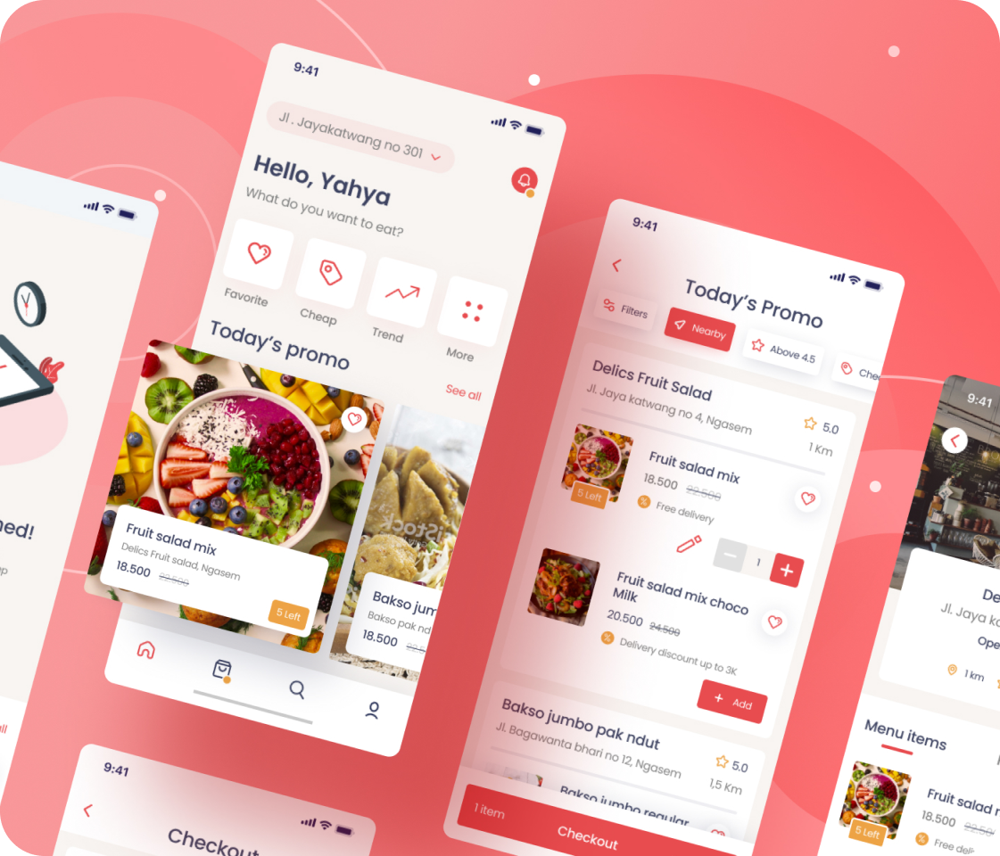
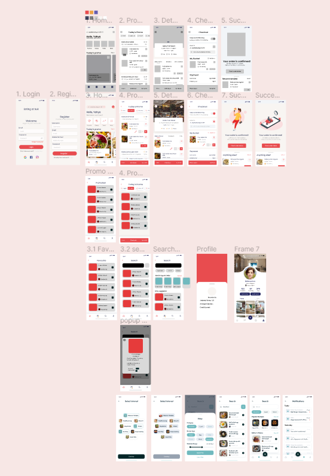

<h1 align="center">Food delivery App 
 </h1>

A current working project 
 

This project is the mobile app interface of a simple food delivery system.

Technology used:

backend:

- lowdb

  frontend:

- Reactjs, vite

Design:

- Figma
  (https://www.figma.com/file/NblzZFPEEqCnJ1GqR6Xf7S/Fooder-UI-Kit-(Community)?type=design&node-id=37%3A82&mode=design&t=7kuDSm3UHpOjAYr6-1 )
 
Backend tables:

- User
- Food menu (Name, description, urlPhoto, credit(price), amount available, Favourite)

